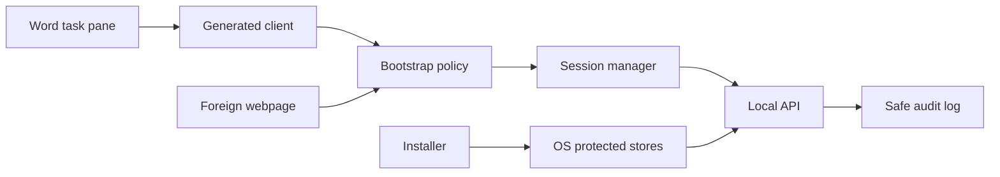

# Bootstrap threat model

## Executive summary

The primary v1 risks are foreign-webpage requests to the loopback companion, invalid
session use, replay, local listener exposure, and unsafe error handling. The selected
bootstrap policy accepts the exact origin or one verified macOS Word embedded-host
profile. It does not cryptographically authenticate Word.

## Scope and assumptions

The model covers the local companion listener, task pane, bootstrap route, session
manager, installer-owned trust, startup state, and safe logs. It also covers the generated
client and the hostile-browser test harness.

The model uses these confirmed assumptions:

- The local operating-system user account is the v1 trust boundary.
- The companion binds only to `127.0.0.1:4179`.
- The stable origin is `https://localhost:4179`.
- Bootstrap operates offline.
- Microsoft Entra and Office single sign-on are prohibited for bootstrap.
- Word-specific cryptographic attestation is not required for v1.

Same-user native malware, malicious browser extensions, and a compromised user profile
are out of scope. These actors can imitate local request context. Real Windows Word
Desktop behavior remains an open pre-release question.

## System model

### Primary components

The system has these security-relevant components:

- Microsoft Word Desktop hosts the React task pane and production Office.js.
- The generated client sends bootstrap and health requests.
- The FastAPI local companion owns request classification and sessions.
- The operating-system trust and credential stores protect installation material.
- The installer owns startup, repair, and uninstall state.
- SQLite and the content store are future protected local assets.

### Data flows and trust boundaries

- Word task pane → local companion: HTTPS bootstrap body, one-use browser material, and Fetch Metadata. The companion applies the exact bootstrap policy and Pydantic schema.
- Foreign webpage → local companion: Cross-site browser requests. The companion rejects unexpected Origin, Host, Fetch Metadata, method, and media type values.
- Generated client → session manager: Session cookie and CSRF header. The companion validates expiry, keyed digests, and session binding.
- Installer → operating-system stores: Root, leaf, private key, and installation secret. Platform adapters use protected stores and private directories.
- Companion → safe log: Categorical result and reason code only. The companion omits raw headers, cookies, bodies, secrets, paths, and document content.

#### Diagram

## Assets and security objectives

| Asset | Why it matters | Security objective |
| :--- | :--- | :--- |
| Installation secret | Protects keyed session and bootstrap digests | Confidentiality and integrity |
| Server private key | Authenticates the stable HTTPS origin | Confidentiality and integrity |
| Bootstrap material | Permits one session-establishment attempt | Confidentiality and integrity |
| Session cookie | Authorizes local API access | Confidentiality and integrity |
| Session CSRF token | Binds browser requests to one session | Confidentiality and integrity |
| Bootstrap policy | Defines the accepted browser-origin boundary | Integrity |
| Startup and installer state | Preserves listener and origin availability | Integrity and availability |
| Safe logs | Support diagnosis without secret disclosure | Integrity and confidentiality |
| Future research data | A session can reach protected local data in later phases | Confidentiality and integrity |

## Attacker model

### Capabilities

An in-scope attacker can perform these actions:

- Host a foreign webpage that targets the loopback origin
- Send cross-site fetches, forms, preflights, navigations, and simple requests
- Supply malformed or duplicate HTTP header values
- Replay expired or consumed browser material
- Attempt Domain Name System (DNS) rebinding
- Connect from a remote network if the listener is misconfigured
- Occupy port `4179` as the local user
- Trigger errors and inspect browser-visible responses

### Non-capabilities

The in-scope remote-web attacker cannot read HttpOnly cookies through ordinary
JavaScript. The attacker cannot read a cross-origin response without a browser defect.
The attacker cannot write protected installation state without local authority.

The model does not claim resistance to a same-user native process that forges every
header. It also does not claim resistance to a malicious extension or compromised user
profile.

## Entry points and attack surfaces

| Surface | How reached | Trust boundary | Notes | Evidence |
| :--- | :--- | :--- | :--- | :--- |
| `GET /taskpane` | Word or local browser navigation | Browser to companion | Issues short-lived bootstrap material | `api/routes.py`, `api/taskpane.py` |
| `POST /api/v1/session/bootstrap` | Generated client or hostile browser request | Unauthenticated browser to session authority | Uses bootstrap-only request classification | `api/bootstrap_policy.py`, `application/bootstrap.py` |
| `GET /api/v1/health` | Authenticated generated client | Session boundary | Requires session cookie and CSRF token | `api/routes.py`, `session.py` |
| TLS port `4179` | Local or misrouted network client | Network to companion | Must bind only to loopback | `settings.py`, `main.py` |
| Manifest source location | Word add-in discovery | Office host to local origin | Contains no secret | `manifest/word-researcher.xml` |
| Credential and trust stores | Installer and companion | Process to operating system | Protect durable material | `platform/credentials.py`, installers |
| Rejection log | Every rejected request | Untrusted input to log sink | Stores categorical values only | `api/app.py` |

## Top abuse paths

1. A foreign webpage sends a bootstrap request with an unexpected Origin. The policy rejects the request before session creation.
2. A cross-site form omits custom headers and uses a form media type. The policy rejects its Origin and request shape.
3. A browser request omits Origin and Fetch Metadata. The policy rejects the incomplete embedded-host profile.
4. A hostile page targets a loopback Internet Protocol address. The exact Host and certificate origin do not match.
5. An attacker replays consumed bootstrap material. The session manager rejects the missing pending record.
6. An attacker reuses an expired session or wrong CSRF token. The session manager rejects the request before the use case.
7. A remote client reaches a listener that bound incorrectly. Loopback configuration tests detect the exposure.
8. A local process occupies the stable port. Companion startup fails closed and records an actionable error.
9. A rejection path logs raw headers or cookies. Secret-canary tests detect the disclosure.

## Threat model table

| Threat ID | Threat source | Prerequisites | Threat action | Impact | Impacted assets | Existing controls | Gaps | Recommended mitigations | Detection ideas | Likelihood | Impact severity | Priority |
| :--- | :--- | :--- | :--- | :--- | :--- | :--- | :--- | :--- | :--- | :--- | :--- | :--- |
| TM-001 | Foreign webpage | Victim browser can reach localhost | Sends cross-site bootstrap requests | Unauthorized local session | Session and future research data | Exact unexpected-Origin rejection, Fetch Metadata, SameSite, CORS denial | Webview headers can change | Keep bootstrap-only strict profiles and rerun real-host tests | Categorical origin rejection count | Medium | High | high |
| TM-002 | Foreign webpage | Browser sends no Origin on a request type | Attempts the missing-Origin branch | Unauthorized local session | Bootstrap policy and session | Full host, peer, scheme, method, path, media type, and Fetch Metadata conjunction | Browser behavior differs by engine | Reject every missing or alternate field | Hostile-browser matrix | Low | High | medium |
| TM-003 | Replay client | Obtains stale browser material | Reuses consumed or expired bootstrap material | Extra session | Bootstrap and session state | Short expiry, signed cookie, pending-record consume | State is process-local in Phase 1 | Preserve one listener and test restart behavior | Replay reason code | Low | High | medium |
| TM-004 | Cross-site request forgery attacker | Browser sends ambient cookies | Invokes a later mutation without the session CSRF token | Local state change | Session and future domain state | Strict SameSite cookie and separate session-bound CSRF | No Phase 1 domain mutations exist | Attach shared session guard to every later mutation | CSRF rejection count | Low | High | medium |
| TM-005 | Remote network client | Listener binds beyond loopback | Connects from another host | Remote API access | All local API assets | Fixed `127.0.0.1` bind and listener tests | Platform misconfiguration remains possible | Fail startup on any non-loopback bind | Socket inspection | Low | High | high |
| TM-006 | DNS rebinding page | Companion accepts alternate Host | Targets loopback with an attacker hostname | Browser-origin bypass | Request boundary | Exact Host, localhost certificate, no wildcard | Native clients can forge Host but are out of scope | Preserve exact serialized Host | Rebinding fixture | Low | High | medium |
| TM-007 | Local port-squatting process | Same user starts first | Occupies port `4179` | Companion unavailable | Stable-origin availability | Fixed port and fail-closed startup | Same-user denial remains possible | Give an actionable repair error | Port-owner diagnostic | Medium | Medium | medium |
| TM-008 | Logging defect | Error path includes attacker input | Writes secrets or raw headers to logs | Local secret disclosure | Bootstrap, session, logs | Categorical codes and canary scans | New code can regress | Keep closed log fields and regression scans | Secret canary test | Low | High | medium |
| TM-009 | Office update | WKWebView request profile changes | Legitimate Word request no longer matches | Availability failure | Word bootstrap | Typed profile and real-host evidence | Automatic Office updates can change behavior | Version evidence and support matrix rerun | Host-profile mismatch trend | Medium | Medium | medium |

The local-user assumption most affects the risk ranking. If same-user native clients
become in scope, the selected profile is not an authentication proof and the architecture
requires review.

## Criticality calibration

Critical means a remote browser path can execute privileged operations and disclose
research data without a valid session. No current Phase 1 threat has verified this result.

High means a remote client can create a session or reach the API because a core network
or browser-origin control failed. Examples are non-loopback binding and permissive
cross-origin bootstrap.

Medium means a constrained replay, port denial, log defect, or Office profile drift can
affect one local installation. Existing fail-closed controls limit the effect.

Low means a request discloses only non-secret categorical data or causes a recoverable
rejection without session creation.

## Focus paths for security review

| Path | Why it matters | Related Threat IDs |
| :--- | :--- | :--- |
| `companion/src/researcher_companion/api/bootstrap_policy.py` | Owns exact request classification | TM-001, TM-002, TM-006, TM-009 |
| `companion/src/researcher_companion/api/bootstrap_adapter.py` | Extracts untrusted HTTP values | TM-001, TM-002, TM-005 |
| `companion/src/researcher_companion/application/bootstrap.py` | Coordinates authorization and session creation | TM-001, TM-003 |
| `companion/src/researcher_companion/session.py` | Owns expiry, replay, session rotation, and CSRF | TM-003, TM-004 |
| `companion/src/researcher_companion/api/routes.py` | Defines unauthenticated and authenticated routes | TM-001, TM-004 |
| `companion/src/researcher_companion/api/app.py` | Maps safe errors and rejection logs | TM-008 |
| `companion/src/researcher_companion/api/http_policy.py` | Bounds API bodies and cache behavior | TM-001 |
| `taskpane/src/generated/client.ts` | Sends browser-visible bootstrap and CSRF values | TM-003, TM-004 |
| `installers/macos/` | Owns loopback trust, startup, repair, and cleanup | TM-005, TM-007 |
| `installers/windows/` | Defines the unproved Windows installation behavior | TM-005, TM-009 |

## Quality check

- Covered every current task pane and API entry point.
- Covered browser, network, session, installer, and logging boundaries.
- Separated runtime behavior from installer and test tooling.
- Used the confirmed offline and no-SSO constraints.
- Recorded real Windows Word Desktop as unproved.
- Recorded same-user native clients and malicious extensions as out of scope.
- Distinguished browser-origin protection from Word attestation.
